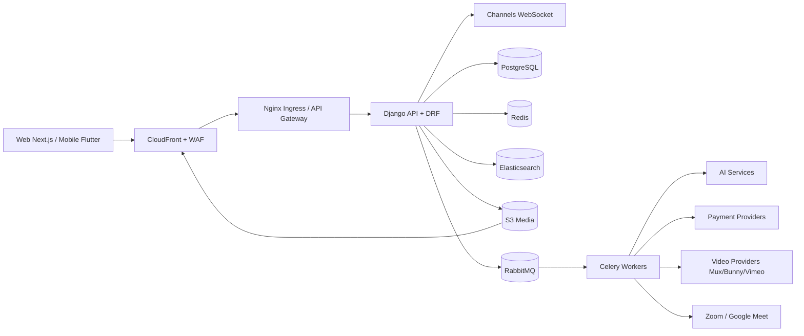

# Technical Architecture - Enterprise Learning Platform

## 1. Architecture Goals
- Support 10M+ learners, 100K+ concurrent active sessions, and 10K+ instructors.
- Enable global low-latency video delivery and resilient transactions.
- Maintain strict tenant-aware security, observability, and compliance controls.
- Allow independent scaling and deployment of critical capabilities.

## 2. Architectural Style
- Domain-driven modular monolith as Phase 1 foundation (Django apps per bounded context).
- Event-driven integration using RabbitMQ + Celery for asynchronous workloads.
- Evolution path to microservices for Search, Payments, Analytics, and AI workloads.

## 3. Core Backend Components
- API Gateway/Edge: Nginx + AWS ALB/WAF + CloudFront.
- Application Layer: Django + DRF (REST), Django Channels (WebSocket real-time features).
- AuthN/AuthZ: JWT, OAuth2 social login (Google, Apple, Facebook), RBAC/ABAC.
- Async Processing: Celery workers, Celery Beat scheduler, RabbitMQ broker, Redis cache/result backend.
- Data: PostgreSQL (OLTP), Redis (cache/session/rate limits), Elasticsearch (search/indexing).
- Object/Media: AWS S3 for assets, CloudFront for CDN distribution.
- Video: Mux/Bunny/Vimeo integration abstraction (provider strategy pattern).
- Live Sessions: Zoom/Google Meet conferencing adapter (per-instructor OAuth) behind a common `ConferencingProvider` interface (`create_meeting`, `update_meeting`, `cancel_meeting`, `get_recording`); Celery Beat drives reminder dispatch and recording-availability polling.
- Integrations: Stripe/PayPal/Flutterwave/Paystack/MPESA payment adapters.
- Analytics: Event pipeline + warehouse export (S3 parquet) + BI tool.

### 3.1 Conferencing Adapter Design Note
- Both Zoom and Google Meet meetings are created **under the instructor's own connected account** (per-instructor OAuth), not a platform-owned account — Google Meet has no API to create meetings on arbitrary third-party accounts without Google Workspace domain-wide delegation, which most individual instructors won't have. Using per-instructor OAuth for both providers keeps the integration uniform.
- Zoom exposes a `recording.completed` webhook; Google Meet does not — recording readiness for Meet is detected by polling the Google Drive API for the recording file after `scheduled_end_at` passes (see [Core Flows: Live Session](../04-platform-structure/02-core-flows.md#9-live-session-scheduling-and-join-flow)).
- OAuth tokens are stored in `conferencing_accounts` (see [Database Schema](../02-database/01-database-erd-and-schema.md)), encrypted at rest, and refreshed by a Celery task before expiry.

## 4. High-Level Context Diagram

## 5. Deployment Topology (AWS + Kubernetes)
- EKS clusters split by environment: dev, stage, prod.
- Phase 1 (current): the modular monolith deploys as four workload types within a single `platform` namespace — `api` (Django/DRF), `ws` (Channels ASGI), `worker` (Celery), `beat` (Celery scheduler). See [Infrastructure Diagram](02-infrastructure-diagram.md).
- Phase 2+: as domains are extracted per the [Evolution Plan](#10-evolution-plan) (Search, Notifications, Payments, Recommendations), each extracted service gets its own namespace (`search`, `comms`, `payments`, `ai`) so it can scale, deploy, and fail independently of the core `platform` namespace.
- Pod autoscaling (HPA), cluster autoscaling, node pools by workload profile.
- Managed services: RDS PostgreSQL (Multi-AZ), ElastiCache Redis, OpenSearch, S3, CloudFront, SNS/SQS (optional), Secrets Manager, KMS.

## 6. Scalability Strategy
- Horizontal scaling for stateless API pods.
- Read replicas + partitioning for high-write tables (events, watch history).
- Redis cache-aside for course catalog, landing pages, recommendation feeds.
- Async-first processing for email, certificate generation, transcripts, subtitles, analytics aggregation.
- Backpressure controls: queue priorities, retries, dead-letter queues.

## 7. Reliability and Availability
- SLO targets:
  - API availability: 99.95%
  - Checkout and enrollment: 99.99%
  - Video playback start success: 99.9%
- Multi-AZ infrastructure and rolling/blue-green deployments.
- Circuit breakers + idempotency keys for payment and webhook handlers.
- Graceful degradation for non-critical features (recommendation, AI tutor).

## 8. Security Architecture
- JWT short-lived access tokens + rotating refresh tokens.
- RBAC for all user types; policy guard layer at view + service tiers.
- WAF + rate limiting + bot/fraud detection rules.
- Data encryption at rest (KMS) and in transit (TLS 1.2+).
- Signed URL and tokenized playback for video assets.
- Audit trail for admin and finance operations (immutable log stream).

## 9. Observability Architecture
- Logs: structured JSON to CloudWatch/OpenSearch.
- Metrics: Prometheus + Grafana dashboards.
- Traces: OpenTelemetry + Jaeger/Tempo.
- Alerting: PagerDuty/Slack with severity routing.

## 10. Evolution Plan
- Phase 1: Modular monolith + event-driven async.
- Phase 2: Extract Search service and Notification service.
- Phase 3: Extract Payments and Recommendation service.
- Phase 4: Multi-region active-passive for global resilience.
