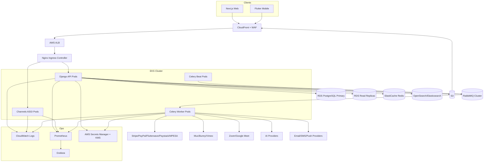

# Infrastructure Diagram

```mermaid
flowchart TB
  subgraph Clients
    WEB[Next.js Web]
    APP[Flutter Mobile]
  end

  WEB --> CDN[CloudFront + WAF]
  APP --> CDN

  CDN --> ALB[AWS ALB]
  ALB --> ING[Nginx Ingress Controller]

  subgraph EKS[EKS Cluster]
    API[Django API Pods]
    WS[Channels ASGI Pods]
    WRK[Celery Worker Pods]
    BEAT[Celery Beat Pods]
  end

  ING --> API
  ING --> WS
  API --> RDS[(RDS PostgreSQL Primary)]
  API --> RR[(RDS Read Replicas)]
  API --> RED[(ElastiCache Redis)]
  API --> ES[(OpenSearch/Elasticsearch)]
  API --> S3[(S3)]
  API --> MQ[(RabbitMQ Cluster)]

  MQ --> WRK
  BEAT --> MQ
  WRK --> PAY[Stripe/PayPal/Flutterwave/Paystack/MPESA]
  WRK --> VID[Mux/Bunny/Vimeo]
  WRK --> LIVE[Zoom/Google Meet]
  WRK --> AI[AI Providers]
  WRK --> MAIL[Email/SMS/Push Providers]

  S3 --> CDN

  subgraph Ops
    CWL[CloudWatch Logs]
    PRM[Prometheus]
    GRA[Grafana]
    SEC[AWS Secrets Manager + KMS]
  end

  API --> CWL
  WS --> CWL
  WRK --> CWL
  API --> PRM
  WS --> PRM
  WRK --> PRM
  PRM --> GRA
  API --> SEC
  WRK --> SEC
```
