# Database ERD and Normalized Schema

## 1. Design Principles
- PostgreSQL 16+ with 3NF normalization for transactional consistency.
- Tenant-aware design for organizations and enterprise customers.
- Soft-delete + immutable audit/event tables.
- High-cardinality event tables partitioned by month.

## 2. ERD (Logical)

```mermaid
erDiagram
  USERS ||--o{ USER_ROLES : has
  ROLES ||--o{ USER_ROLES : maps
  ROLES ||--o{ ROLE_PERMISSIONS : grants
  PERMISSIONS ||--o{ ROLE_PERMISSIONS : maps

  USERS ||--o{ COURSES : creates
  COURSES ||--o{ SECTIONS : contains
  SECTIONS ||--o{ LESSONS : contains
  LESSONS ||--o| VIDEOS : references

  COURSES ||--o{ QUIZZES : has
  QUIZZES ||--o{ QUESTIONS : has
  QUESTIONS ||--o{ ANSWERS : has
  COURSES ||--o{ CODING_EXERCISES : has
  CODING_EXERCISES ||--o{ CODING_EXERCISE_SUBMISSIONS : receives

  USERS ||--o{ ENROLLMENTS : owns
  COURSES ||--o{ ENROLLMENTS : receives
  ENROLLMENTS ||--o{ PROGRESS_TRACKING : tracks

  ENROLLMENTS ||--o| CERTIFICATES : issues

  USERS ||--o{ PAYMENTS : makes
  PAYMENTS ||--o| INVOICES : generates
  PAYMENTS ||--o{ TRANSACTIONS : records
  ORDERS ||--o{ PAYMENTS : settled_by
  ORDERS ||--o{ GIFT_CARD_REDEMPTIONS : applies
  GIFT_CARDS ||--o{ GIFT_CARD_REDEMPTIONS : redeemed_as
  PROMOTIONS ||--o{ COUPONS : bundles
  PLANS ||--o{ SUBSCRIPTIONS : priced_by

  COURSES ||--o{ REVIEWS : receives
  USERS ||--o{ REVIEWS : writes

  USERS ||--o{ WISHLISTS : has
  WISHLISTS ||--o{ WISHLIST_ITEMS : includes
  USERS ||--o{ BOOKMARKS : has

  USERS ||--o{ AFFILIATE_ACCOUNTS : owns
  AFFILIATE_ACCOUNTS ||--o{ AFFILIATE_COMMISSIONS : earns

  ORGANIZATIONS ||--o{ ORG_MEMBERS : contains
  ORGANIZATIONS ||--o{ SUBSCRIPTIONS : purchases

  USERS ||--o{ SUPPORT_TICKETS : creates
  USERS ||--o{ MESSAGES : sends
  USERS ||--o{ NOTIFICATIONS : receives
  NOTIFICATION_TEMPLATES ||--o{ NOTIFICATIONS : renders

  USERS ||--o{ AI_CHAT_SESSIONS : starts
  AI_CHAT_SESSIONS ||--o{ AI_CHAT_MESSAGES : contains
  COURSES ||--o{ FLASHCARDS : generates

  USERS ||--o{ CONFERENCING_ACCOUNTS : connects
  COURSES ||--o{ LIVE_SESSIONS : schedules
  USERS ||--o{ LIVE_SESSIONS : hosts
  LIVE_SESSIONS ||--o{ LIVE_SESSION_REGISTRATIONS : has
  USERS ||--o{ LIVE_SESSION_REGISTRATIONS : registers
  LIVE_SESSIONS ||--o| LIVE_SESSION_RECORDINGS : produces

  COURSES }o--o{ TAGS : tagged
  COURSES }o--o{ CATEGORIES : categorized

  USERS ||--o{ AUDIT_LOGS : actor
```

## 3. Core Tables (Normalized)

### Identity and Access
- users(id, email, password_hash, status, created_at, updated_at)
- profiles(user_id PK/FK, first_name, last_name, bio, avatar, locale, timezone, linkedin_url, twitter_url, github_url, youtube_url, website_url)
- roles(id, code, name, scope)
- permissions(id, resource, action)
- user_roles(user_id, role_id, context_type, context_id)
- role_permissions(role_id, permission_id)
- oauth_identities(id, user_id, provider, provider_user_id, metadata)
- refresh_tokens(id, user_id, token_hash, device_fingerprint, expires_at, revoked_at)
- mfa_factors(id, user_id, factor_type, secret_encrypted, is_primary)

### Course Domain
- courses(id, owner_user_id, title, slug, summary, description, language, difficulty, price_amount, currency, status, published_at)
- course_prerequisites(id, course_id, text)
- course_learning_objectives(id, course_id, text)
- sections(id, course_id, title, sort_order)
- lessons(id, section_id, lesson_type, title, sort_order, duration_seconds, is_preview)
- videos(id, lesson_id, provider, provider_asset_id, playback_policy, transcript_status, subtitles_status, watermark_enabled)
- downloadable_resources(id, lesson_id, file_key, file_name, size_bytes)
- captions(id, video_id, language, file_key)
- transcripts(id, video_id, language, text, source)

### Live Sessions
- conferencing_accounts(id, user_id, provider, external_account_id, access_token_encrypted, refresh_token_encrypted, token_expires_at, connected_at, revoked_at)
- live_sessions(id, course_id nullable, host_user_id, conferencing_account_id, provider, title, description, scheduled_start_at, scheduled_end_at, timezone, status, capacity nullable, external_meeting_id, join_url, host_join_url, is_recorded)
- live_session_registrations(id, live_session_id, student_id, status, registered_at, joined_at, left_at, attended_duration_seconds)
- live_session_recordings(id, live_session_id, provider_recording_id, playback_url, download_key, duration_seconds, available_at)

### Assessment
- quizzes(id, course_id, section_id nullable, title, attempts_allowed, pass_score)
- questions(id, quiz_id, type, prompt, explanation)
- answers(id, question_id, text, is_correct)
- assignments(id, course_id, title, instructions, due_policy)
- assignment_submissions(id, assignment_id, student_id, content_ref, grade, graded_by, graded_at)
- coding_exercises(id, course_id, section_id nullable, title, prompt, starter_code, language, time_limit_ms, memory_limit_mb)
- coding_exercise_test_cases(id, coding_exercise_id, input, expected_output, is_hidden, weight)
- coding_exercise_submissions(id, coding_exercise_id, student_id, source_code, language, status, score, runtime_ms, submitted_at, graded_at)

### Learning and Engagement
- enrollments(id, course_id, student_id, source, status, enrolled_at, completed_at)
- progress_tracking(id, enrollment_id, lesson_id, percent_complete, last_position_seconds, last_viewed_at)
- lesson_notes(id, lesson_id, student_id, note_text, timestamp_seconds)
- bookmarks(id, lesson_id, student_id, timestamp_seconds, label)
- recently_viewed(id, user_id, course_id, viewed_at)
- reviews(id, course_id, user_id, rating, review_text, is_verified_purchase)
- certificates(id, enrollment_id, certificate_uid, qr_payload, pdf_key, issued_at)
- wishlists(id, user_id, created_at)
- wishlist_items(id, wishlist_id, course_id, added_at)

### Commerce
- payment_methods(id, user_id, provider, provider_pm_id, metadata)
- coupons(id, code, discount_type, discount_value, valid_from, valid_to, usage_limit, per_user_limit, promotion_id nullable)
- promotions(id, name, campaign_type, banner_asset_key, starts_at, ends_at, status, created_by)
- gift_cards(id, code, balance_amount, currency, expires_at, issued_by)
- gift_card_redemptions(id, gift_card_id, order_id, amount_applied, redeemed_at)
- orders(id, buyer_id, subtotal_amount, discount_amount, tax_amount, gift_card_amount, total_amount, currency, status)
- order_items(id, order_id, item_type, item_id, unit_price, quantity)
- payments(id, order_id, provider, provider_payment_id, status, amount, currency, paid_at)
- invoices(id, order_id, invoice_number, tax_metadata, pdf_key, issued_at)
- refunds(id, payment_id, provider_refund_id, amount, reason, status)
- plans(id, code, name, billing_interval, price_amount, currency, seat_model, features_json, is_active)
- subscriptions(id, subscriber_type, subscriber_id, plan_id, status, started_at, renews_at, canceled_at)
- wallets(id, owner_type, owner_id, balance_amount, currency)
- transactions(id, wallet_id, direction, amount, reason, reference_type, reference_id)
- payouts(id, instructor_id, period_start, period_end, amount_gross, amount_net, status, paid_at)
- affiliate_accounts(id, user_id, referral_code, commission_rate)
- affiliate_referrals(id, affiliate_id, referred_user_id, order_id, status)
- affiliate_commissions(id, referral_id, commission_amount, payout_status)

### Enterprise and Organization
- organizations(id, name, slug, billing_email, status)
- org_members(id, organization_id, user_id, role, status)
- learning_paths(id, owner_type, owner_id, title, description)
- learning_path_items(id, learning_path_id, course_id, sort_order)
- course_bundles(id, owner_type, owner_id, title, price_amount, currency)
- course_bundle_items(id, bundle_id, course_id)

### CMS and Taxonomy
- categories(id, parent_id nullable, name, slug)
- tags(id, name, slug)
- course_categories(course_id, category_id)
- course_tags(course_id, tag_id)
- blog_posts(id, author_id, title, slug, content, status, published_at, seo_meta)

### Communication and Support
- threads(id, thread_type, subject, created_by)
- thread_participants(id, thread_id, user_id)
- messages(id, thread_id, sender_id, body, metadata, created_at)
- notification_templates(id, code, channel, locale, subject_template, body_template, is_active)
- notifications(id, user_id, template_code nullable, type, channel, title, body, read_at, sent_at)
- email_templates(id, code, locale, subject, html_body, text_body, is_active)
- support_tickets(id, requester_id, assignee_id, category, priority, status, subject)
- support_ticket_messages(id, ticket_id, sender_id, body)

### AI Features
- ai_chat_sessions(id, user_id, course_id nullable, context_type, started_at, ended_at)
- ai_chat_messages(id, session_id, role, content, tokens_used, created_at)
- ai_generated_content(id, content_type, source_type, source_id, user_id nullable, content_payload, model_used, status, created_at)
- ai_generation_jobs(id, job_type, source_type, source_id, status, requested_by, started_at, completed_at, error_message)
- flashcards(id, course_id, lesson_id nullable, generated_by, front_text, back_text, created_at)

### Compliance, Settings, Analytics
- audit_logs(id, actor_user_id, action, entity_type, entity_id, ip_address, user_agent, payload, created_at)
- settings(id, scope_type, scope_id, key, value_json)
- analytics_events(id, event_name, actor_user_id, course_id, session_id, payload, occurred_at)
- reports(id, report_type, period_start, period_end, generated_by, storage_key)

## 4. Physical Design Notes
- Indexes:
  - users(email unique), courses(slug unique), enrollments(student_id, course_id unique), certificates(certificate_uid unique)
  - progress_tracking(enrollment_id, lesson_id unique)
  - analytics_events(event_name, occurred_at), payments(status, paid_at)
  - wishlist_items(wishlist_id, course_id unique), gift_cards(code unique), gift_card_redemptions(gift_card_id, order_id unique)
  - plans(code unique), promotions(status, starts_at, ends_at), coupons(code unique)
  - coding_exercise_submissions(coding_exercise_id, student_id, submitted_at)
  - notification_templates(code, locale unique), email_templates(code, locale unique)
  - ai_chat_messages(session_id, created_at), flashcards(course_id, lesson_id)
  - conferencing_accounts(user_id, provider unique), live_sessions(course_id, scheduled_start_at), live_sessions(host_user_id, status)
  - live_session_registrations(live_session_id, student_id unique), live_session_recordings(live_session_id unique)
- Foreign keys:
  - subscriptions.plan_id -> plans.id (ON DELETE RESTRICT)
  - coupons.promotion_id -> promotions.id (ON DELETE SET NULL, nullable)
  - gift_card_redemptions.gift_card_id -> gift_cards.id, gift_card_redemptions.order_id -> orders.id (ON DELETE RESTRICT)
  - notifications.template_code -> notification_templates.code (ON DELETE SET NULL, nullable)
  - live_sessions.conferencing_account_id -> conferencing_accounts.id (ON DELETE RESTRICT)
  - live_session_registrations.live_session_id -> live_sessions.id (ON DELETE CASCADE)
- Partitioning:
  - analytics_events monthly partitions.
  - audit_logs monthly partitions.
- Constraints:
  - CHECK ratings between 1 and 5.
  - CHECK currency ISO-4217 code format.
  - FK with ON DELETE RESTRICT for critical financial references.

## 5. Data Governance
- PII classification tags on user/profile/payment tables.
- Data retention policies per region and regulation (GDPR/CCPA).
- Right-to-erasure workflow with legal hold exceptions.
- Third-party OAuth tokens (`conferencing_accounts.*_token_encrypted`) encrypted at rest via KMS and never exposed through the API; revoked immediately on account disconnect.
