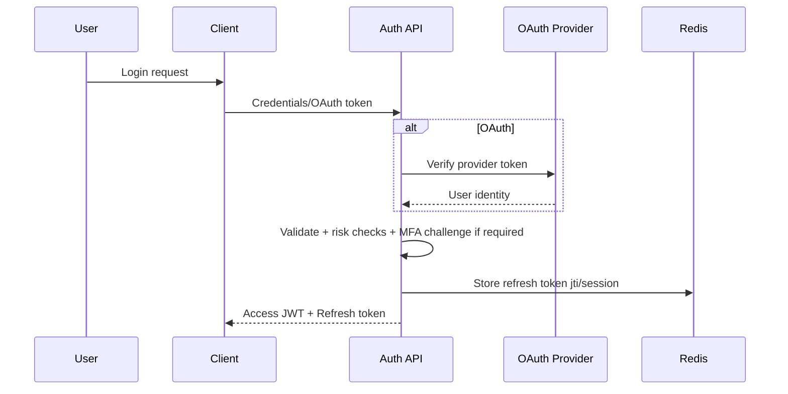
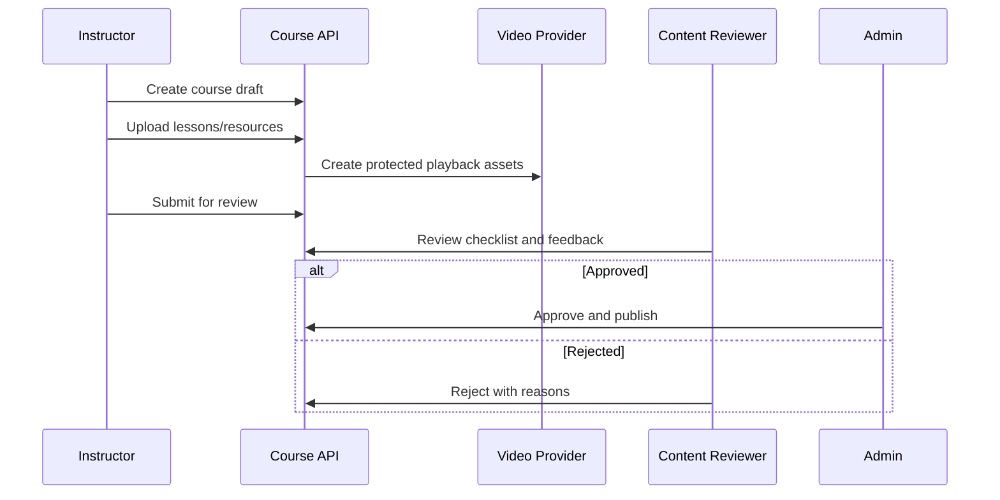
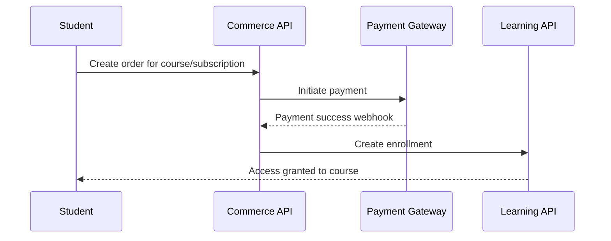
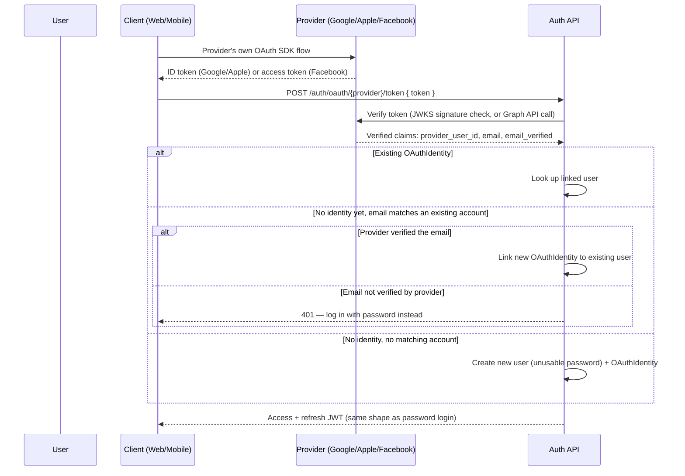
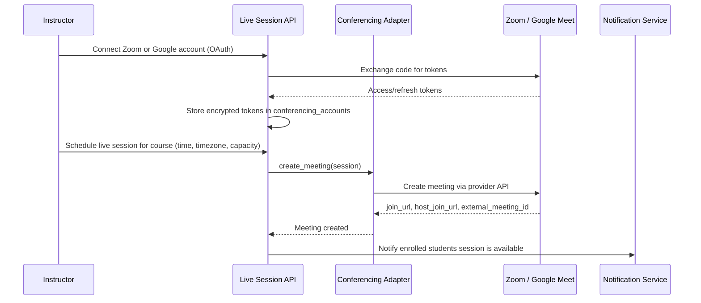
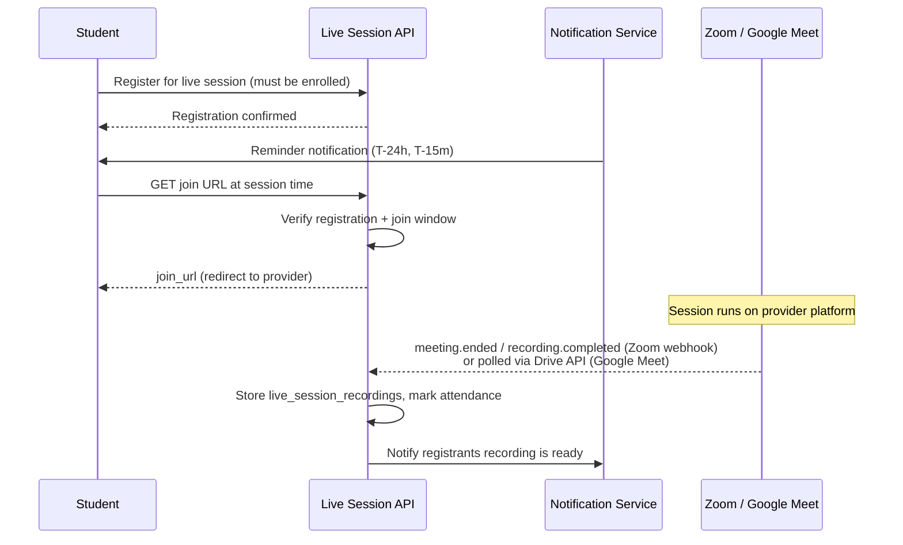

# Authentication and Core Business Flows

## 1. Authentication Flow

## 2. Course Creation and Approval Flow

## 3. Enrollment Flow

## 4. Payment and Refund Flow
- Order creation with tax/coupon validation.
- Payment intent/authorization at provider.
- Webhook reconciliation and idempotent settlement update.
- Invoice generation and notification dispatch.
- Refund request -> eligibility policy -> provider refund -> ledger update.

## 5. Certificate Generation Flow
- Completion rule evaluator confirms all mandatory units passed.
- Certificate service generates unique ID + QR payload.
- PDF renderer creates signed certificate artifact in S3.
- Verification endpoint validates ID and checksum.

## 6. Instructor Approval Flow
- Instructor application with KYC/tax profile.
- Compliance checks by moderation/finance.
- Approval sets role + payout account eligibility.

## 7. Admin Workflow
- Intake queues: pending courses, flagged reviews, support tickets, fraud alerts.
- Decision actions create immutable audit log records.
- Operational reports for finance, support, and trust & safety.

## 8. OAuth Social Login Flow

The client drives the OAuth exchange with the provider's own SDK (Google Sign-In, Sign in with Apple, Facebook Login) rather than the backend running a server-side redirect flow — this platform serves both a Next.js web client and a native Flutter client, and token verification is the one pattern that's uniform across both instead of needing a redirect flow for web and a native-SDK flow for mobile.

- An unverified email is never used to silently link to an existing account — that would let an attacker who controls a weaker provider hijack a real user's account by claiming their email address.
- Apple only returns an email on the user's *first* authorization for a given app; a returning user is recognized by their already-linked `OAuthIdentity`, not by email.

## 9. Live Session Scheduling and Join Flow

### Scheduling

### Registration, Join, and Recording

- Join links are never issued outside the join window (default: 15 minutes before start through session end) even to registered students, to prevent link sharing/leakage.
- Zoom recording availability arrives via the `recording.completed` webhook; Google Meet has no equivalent webhook, so a Celery Beat task polls the Google Drive API for the recording file starting at `scheduled_end_at`.
- If a session ends with no recording detected after a timeout window, support is alerted and affected registrants are notified so a manual resolution (reschedule, partial refund) can be issued.

## 10. User Journey Maps (Condensed)

### Student
- Discover course -> evaluate social proof -> checkout -> onboarding -> active learning (incl. registering for and attending live sessions) -> assessment -> certificate -> share/upsell.

### Instructor
- Register -> complete verification -> create content -> submit review -> publish -> engage learners -> receive payout -> iterate course.

### Organization Admin
- Configure org -> invite users -> assign paths -> monitor outcomes -> renew subscription.
