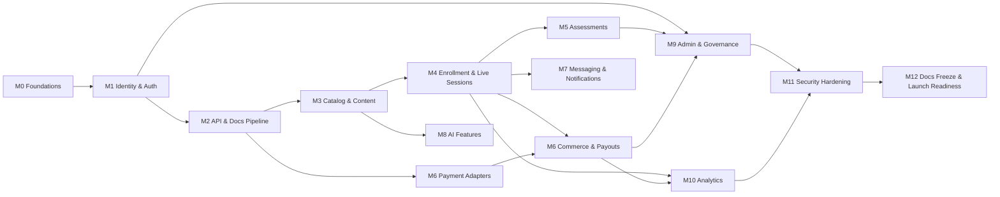

# Backend Build Milestones — Production-Grade, Secure, Fully Documented API

This is the engineering-execution breakdown for building the Django/DRF backend described in
[Technical Architecture](../01-architecture/01-technical-architecture.md),
[Database Schema](../02-database/01-database-erd-and-schema.md), and
[API Documentation](../03-api/01-api-documentation.md). It decomposes the 8-sprint
[Sprint Plan](01-jira-epics-stories-sprints-roadmap.md#3-sprint-plan-initial-8-sprints-2-weeks-each)
into 13 milestones with concrete scope, security gates, and a documentation bar for each —
answering "what does 'done' actually mean" at the level a backend engineer needs to build against.

Every milestone ships against the same [Definition of Done](#1-definition-of-done-applies-to-every-milestone).
A milestone is not complete because the endpoints respond; it's complete when the checklist passes.

## 1. Definition of Done (applies to every milestone)

- **Code**: reviewed and merged via PR — no direct pushes to `main`; migrations reviewed for
  lock/downtime risk on existing tables.
- **Tests**: unit + integration coverage ≥ 85% on new/changed lines; a negative authz test
  ("wrong role gets 403") exists for every new endpoint; contract tests generated from the
  OpenAPI spec pass against the running service.
- **Security**: the milestone's own security checklist (below) is verified; `pip-audit`/`npm
  audit`-equivalent dependency scan and secret scan are clean in CI.
- **API documentation**: `drf-spectacular` schema is regenerated from code, diffed against
  [`docs/03-api/02-openapi.yaml`](../03-api/02-openapi.yaml), and the committed spec is updated
  to match reality (the spec describes what the code does, never the reverse). Every new
  operation has a `summary`, correct `tags`, and at least one worked example. `npx @stoplight/spectral
  lint` passes with zero errors.
- **Swagger UI**: manually spot-checked — auth via the UI's "Authorize" button works, and
  "Try it out" succeeds against a locally running instance for at least the milestone's primary
  happy path.
- **Observability**: structured JSON logs and a request-count/latency metric exist for every new
  endpoint group; unhandled exceptions are traced, not just logged.
- **CI**: lint, type-check, test suite, OpenAPI lint, and security scan all green before merge.

## 2. Milestones

### M0 — Repository, Environments, and CI/CD Foundations
**Sprint 1** · Apps: `shared/`, `config/`

- Monorepo scaffold per [Platform Structure](../04-platform-structure/01-platform-structure.md):
  `backend/config/settings/{base,dev,stage,prod}.py`, `apps/`, `shared/`, `tests/`.
- Docker Compose for local dev: Postgres 16, Redis, RabbitMQ, Elasticsearch/OpenSearch.
- Custom user model stub, health-check endpoint, `django-environ` config, pre-commit
  (ruff, black, mypy, isort).
- GitHub Actions: lint → test → build on every PR (empty test suite passes trivially; the
  pipeline itself is the deliverable).
- Secrets: local `.env.example` committed, real secrets never committed, AWS Secrets Manager
  wiring stubbed for stage/prod settings.

**Security checklist**: `DEBUG=False` enforced outside `dev`; `SECRET_KEY` and DB credentials
sourced from environment, never hardcoded; `.env` in `.gitignore`.

**Exit criteria**: `docker compose up` boots a working Django admin locally in one command; a
trivial PR triggers and passes the full CI pipeline.

---

### M1 — Identity, AuthN/AuthZ, and Audit Foundation
**Sprint 1** · Apps: `identity`, `authorization`, `audit`
**Requirements**: FR-AUTH-001 – FR-AUTH-004, NFR-SEC-001, NFR-SEC-002

- Custom `User` model, `profiles`, `oauth_identities`, `refresh_tokens`, `mfa_factors` (per
  [schema §Identity and Access](../02-database/01-database-erd-and-schema.md)).
- JWT via `djangorestframework-simplejwt`: 15-minute access tokens, 30-day rotating refresh
  tokens, reuse-detection blacklist backed by Redis.
- OAuth2 social login (Google, Apple, Facebook) via `django-allauth` or equivalent adapters.
- MFA enrollment/verification (TOTP first; WebAuthn can follow in a later milestone).
- `roles`, `permissions`, `user_roles`, `role_permissions` models + a DRF permission class that
  resolves context-scoped roles (platform vs. organization) on every request.
- `audit_logs` app: an append-only log, write-only from application code (no update/delete
  path), populated via a signal/decorator so every privileged action is captured without each
  view remembering to log it manually.

**Security checklist**: password hashing via Argon2; rate limiting on `/auth/login` and
`/auth/mfa/verify` (Redis token bucket, per-IP and per-account); refresh-token reuse triggers
full session revocation; OWASP ASVS L1 auth checklist verified.

**API & Swagger**: `/api/v1/auth/*` fully live and documented (register, login, refresh, logout,
MFA enroll/verify, OAuth redirect/callback, me). This is the first milestone where Swagger UI's
"Authorize" flow must work end-to-end — treat it as the template every later milestone copies.

**Exit criteria**: a fresh user can register, verify MFA, log in via Google OAuth, and see their
own audit trail entries; a second user attempting an admin-only action gets a 403 that itself
gets audit-logged.

---

### M2 — API Foundation and Documentation Pipeline — done
**Sprint 1** · Apps: `shared/`, cross-cutting

- `/api/v1` versioning convention; cursor pagination as the default (`shared/api/pagination.py`);
  a single DRF exception handler producing RFC 7807 `problem+json` for every error path.
- `drf-spectacular` wired as the schema generator; `/api/v1/schema/` and a Swagger UI at
  `/api/v1/docs/` live from day one, not bolted on later.
- CI gate: `python manage.py spectacular --fail-on-warn` on every PR — this is what actually
  caught two real bugs during M1 (a couple of views had no inferrable response schema). **Revised
  from the original plan**: this does *not* diff against the committed `docs/03-api/02-openapi.yaml`.
  That file is the aspirational full-platform design (125 routes) written during planning; the
  codebase implements it incrementally, milestone by milestone, so a literal diff would fail every
  PR until the entire API exists. Docs are instead updated by hand alongside each milestone that
  adds real endpoints (see M1's commit history for an example).
- `Idempotency-Key` middleware moved to **M6** — there's nothing to be idempotent about until
  checkout and payment webhooks exist.

**Security checklist**: CORS allowlist via `django-cors-headers`, no wildcard in stage/prod
(`CORS_ALLOWED_ORIGINS` required, no default, outside `dev`); `Referrer-Policy: same-origin`.
CSP baseline **deferred** — Swagger UI needs a deliberately-scoped CSP (it loads its own inline
scripts/styles) and a rushed global policy risks silently breaking it; worth its own pass rather
than a default that looks secure but hasn't been checked against the one page that will break first.

**Exit criteria**: met — `/api/v1/auth/*` (M1) is traceable end-to-end from Django view → generated
OpenAPI operation → live Swagger UI → passing contract test.

---

### M3 — Course Catalog, Content, and Instructor Authoring — core done, two pieces deferred
**Sprint 2–3** · Apps: `catalog`, `content`, `search`
**Requirements**: FR-CRS-001 – FR-CRS-004

**Built and verified end-to-end** (draft → sections/lessons → submit-review → RBAC-gated
approve/reject → publish → public visibility, all exercised over real HTTP against the
containerized stack, not just unit tests):
- `Category`, `Tag`, `Course` (+ prerequisites, learning objectives), `Section`, `Lesson` models
  and instructor-authoring CRUD, all owner-scoped (an instructor can only see/mutate their own
  courses — enforced via queryset filtering + explicit 403s, tested for the negative case too).
- Course lifecycle state machine (`Course.submit_for_review/approve/reject/publish/archive`):
  draft → submitted → approved/rejected → published → archived, enforced server-side via an
  `InvalidCourseTransition` exception a client can't bypass by calling the "wrong" endpoint.
- `/api/v1/admin/courses/*` review endpoints gated by the `courses.approve` permission (seeded
  via migration onto `content_reviewer`/`administrator`/`super_administrator`), not just
  ownership — a student or an unrelated instructor gets a 403.
- Public browsing (`/courses`, `/courses/{id}`, `/courses/{id}/preview`, `/categories`, `/tags`)
  with cursor pagination; unpublished courses return 404 (not 403) to non-owners, so a course's
  existence isn't itself information a stranger should get.

**Deferred to a follow-up** (same reasoning as M1's OAuth/MFA split — shipping a verified core
now rather than a half-tested everything):
- **Video provider adapter** (Mux/Bunny/Vimeo) and the `videos` / `downloadable_resources`
  models — `Lesson.lesson_type` supports `"video"` as a label today, but there's no upload flow
  or provider integration wired up yet.
- **Elasticsearch indexing and `/search/courses`** — the public list endpoint filters on the
  Postgres row directly (category/language/difficulty), which is correct but doesn't touch
  Elasticsearch, Celery, or RabbitMQ; none of that infrastructure has any real task code running
  through it yet despite the containers existing since M0.

**Security checklist**: instructors can only mutate their own courses — done, tested (both the
positive "owner can edit" and negative "non-owner gets 403/404" cases). Uploaded-resource
validation is part of the deferred video/resources piece above.

**Exit criteria**: revised to match the sliced scope — an instructor can author a course
end-to-end and get it published through a permission-gated review, verified live. The original
exit criteria's search-latency clause (NFR-PERF-001) moves to the search follow-up, since there's
no search yet to measure.

---

### M4 — Enrollment, Learning Experience, and Live Sessions — done
**Sprint 4–5** · Apps: `learning`, `live_sessions`
**Requirements**: FR-LRN-001 – FR-LRN-003, FR-LIVE-001 – FR-LIVE-008

**Built and verified end-to-end** (enroll → note/bookmark → progress two lessons to 100% →
enrollment auto-completes → certificate auto-issued → publicly verifiable with no auth, all
exercised over real HTTP):
- `Enrollment` (direct-enroll today — no payment gate, since Commerce/checkout is M6; a
  purchase-driven enrollment there just uses `source="purchase"` instead of a different model),
  `ProgressTracking`, `LessonNote`, `Bookmark`, `Wishlist`/`WishlistItem`, `RecentlyViewed`.
- `Certificate` issuance is real and automatic: `apps.learning.services.maybe_complete_enrollment`
  runs after every progress update, and once every lesson in the course has a 100% progress row,
  it marks the enrollment complete and issues a certificate with a real unique `certificate_uid`
  and a `qr_payload` verification URL. `pdf_key` stays blank — see deferred scope below.
- Notes/bookmarks/progress all require the student to actually be enrolled in the lesson's
  course (403 otherwise, tested).

**Celery infrastructure — built and verified end-to-end**: `config/celery.py` app instance
(fails safe to `config.settings.prod` if `DJANGO_SETTINGS_MODULE` isn't set, same reasoning as
`wsgi.py`/`asgi.py`), RabbitMQ broker + Redis result backend, `worker`/`beat` services added to
`docker-compose.yml`. Proved live by dispatching `shared.health.ping` through a real running
worker consuming from real RabbitMQ and reading the result back from real Redis, cross-checked
against the worker's own log for the exact task ID.

**`live_sessions` app — built and verified end-to-end**:
- `ConferencingAccount`: real authorization-code OAuth2 against Zoom and Google Meet (distinct
  from the M1 identity-login OAuth, which only ever verifies a provider ID token — this flow
  exchanges a `code` for access+refresh tokens the backend calls provider APIs with later).
  Tokens are Fernet-encrypted at rest (`shared/crypto.py`) and never appear in any API response —
  asserted directly in tests (`ConferencingAccountSerializer` excludes the encrypted fields) and
  live (the callback view's created row was inspected directly in the DB, not through the API).
  CSRF state is a signed, 10-minute `django.core.signing` token
  (`apps/live_sessions/oauth_state.py`), same pattern as M1's MFA login-challenge token.
- `LiveSession` scheduling calls the real provider's meeting-creation API
  (`POST /v2/users/me/meetings` for Zoom, `Calendar events.insert` with `conferenceDataVersion=1`
  for Google Meet) and stores the returned `join_url`/`host_join_url`/`external_meeting_id`.
- **Join-window gating (the security-critical piece)**: `LiveSessionJoinView` only returns
  `join_url` to a student who (a) has a non-canceled registration and (b) is within
  `[scheduled_start_at - 15min, scheduled_end_at]` — enforced server-side, never left to the
  client. Verified with explicit boundary tests (not-registered / too-early / window-open /
  after-end / canceled-registration / canceled-session) and live over real HTTP: a request 20
  minutes before start returned 403 with `"Too early..."`, the same session moved into its window
  returned the real `join_url` and flipped the registration to `attended` with a `joined_at`
  timestamp and an audit-log row, all confirmed by reading the database directly afterward.
- `LiveSessionCancelView` cancels locally even if the remote provider call fails (a network
  outage on Zoom's side must never block a local cancellation), recording a
  `live_session.provider_cancel_failed` audit event instead of swallowing the error. Both
  `zoom.py` and `google_meet.py` wrap every outbound `requests` call so a raw network failure
  (timeout, DNS, connection refused) surfaces as `ConferencingProviderError` — a real bug caught
  by a test that simulated a `ConnectionError` on cancel, since the adapters originally only
  handled bad HTTP status codes, not transport-level failures.
- Capacity enforcement, registration/unregistration, recording lookup with host/registered-only
  visibility, and instructor-only registration listing — all tested and verified.
- Celery Beat tasks (5/5/15-minute schedules in `CELERY_BEAT_SCHEDULE`): `dispatch_reminders`
  (identifies who needs reminding — there's no send channel yet, that's M7, so it logs a count
  rather than pretending to send), `poll_google_meet_recordings` (Google has no recording-ready
  webhook, so this is a documented best-effort Drive-search heuristic, not a guarantee),
  `close_ended_sessions`. All three dispatched through the real worker/broker and confirmed via
  the worker's log.

**Deferred to a follow-up** (a distinct, unrelated subsystem):
- **Certificate PDF rendering + storage**: `pdf_key` is a real column with nothing writing to it
  — no S3/file-storage integration exists anywhere in the codebase yet.

**Security checklist**: conferencing OAuth tokens encrypted at rest and never serialized in any
response (verified in tests and live); join-window gating enforced server-side with negative-path
tests for every boundary; unverified/tampered/expired OAuth state tokens rejected (signature and
10-minute max-age both tested); a student must be enrolled in the course to register for its live
sessions (403 otherwise, tested).

**Exit criteria**: met — "enroll → resume playback → earn certificate" and "register → join
within the window, denied outside it → recording available after the fact" are both done and
verified live.

---

### M5 — Assessments: Quizzes, Assignments, Coding Exercises — done, with an honest sandbox caveat
**Sprint 6** · Apps: `assessments`
**Requirements**: FR-LRN-004

**Built and verified end-to-end** (nested authoring → attempt → grade, over real HTTP; coding
judging over a real Celery worker consuming from real RabbitMQ):
- `Quiz`/`Question`/`Answer`: instructor authoring is a single nested-create call (a quiz without
  questions, or a question without a marked-correct answer, is rejected server-side — not just a
  client-side validation). `QuizAttempt`/`QuizResponse` track attempts; `attempts_allowed` is
  enforced against *finished* attempts (a DB-level partial unique constraint additionally
  guarantees only one `in_progress` attempt per student per quiz). Grading treats
  single-choice and multiple-choice uniformly — a response is correct iff the selected answer
  set exactly equals the correct-answer set — verified with a case that selects only one of two
  required multiple-choice answers and confirms it scores as incorrect. `AnswerOptionSerializer`
  never includes `is_correct` on any read path a student can hit, verified in tests and live (a
  quiz detail response was inspected directly for the string `is_correct` and found absent).
- `Assignment`/`AssignmentSubmission`: resubmission before grading updates the existing row
  (no duplicate-submission spam); resubmission after grading is rejected. Grading is
  instructor/owner-only (403 for both a student and a non-owning instructor), records
  `graded_by`/`graded_at`, and appears in `GET /students/me/grades/` alongside submitted quiz
  attempts.
- `CodingExercise`/`CodingExerciseTestCase`/`CodingExerciseSubmission`: submission creation
  returns `202` immediately and dispatches `assessments.judge_coding_submission` via Celery — a
  real submission was posted over real HTTP, graded by a real worker process consuming from real
  RabbitMQ, and polled back as `passed` with a `100.0` score, cross-checked against the worker's
  own log for the exact task ID (same discipline as the M4 Celery verification). Hidden test
  cases' `expected_output` and the submission's actual stdout/stderr for those cases are never
  included in `result_detail` — only `{is_hidden: true, passed: bool}` — verified in both a unit
  test and the live run. Judging is scoped to Python 3 only today; a submission against an
  exercise with any other `language` value is rejected at creation with a clear "not implemented
  yet" error rather than silently queuing something that can never grade.

**Security checklist — sandbox isolation is honestly incomplete, not silently assumed**:
`apps/assessments/judge.py` runs submissions as a real `python3` subprocess bounded by a
wall-clock timeout (reliable cross-platform) and `resource.setrlimit` CPU/memory limits
(POSIX, best-effort — each limit is set independently so a platform that can't honor one, e.g.
macOS's unreliable `RLIMIT_AS`, degrades gracefully instead of crashing the judge). **It does
NOT provide filesystem or network isolation** — a submission can still read any file the
process's OS user can read or open a socket. This is documented loudly in the module docstring
and is a known, deliberate limitation, not an oversight: real isolation needs a locked-down
container (gVisor/Kata), a Firecracker microVM, or a hosted judge API (e.g. Judge0), none of
which are part of this milestone. Consequently the originally-stated exit criterion "a
submission attempting to read `/etc/passwd` or open a socket fails safely" is **not met** by
this implementation and must not be treated as met — a genuine threat-model review and a real
sandbox are required before this endpoint is exposed to untrusted users in production. What
*is* verified: CPU-bound infinite loops are killed at the timeout (tested), syntax/runtime
errors are caught and graded as `error` rather than crashing the worker (tested), and the
memory-limit test is explicitly skipped on macOS with a documented reason rather than asserting
behavior that doesn't hold on this platform.

**Exit criteria**: met for grading correctness — a quiz attempt is scored correctly against
`pass_score`, both over the test suite and live HTTP; a coding submission is judged
asynchronously via a real Celery worker and returns per-test-case pass/fail. **Not met** for
sandbox isolation, per the security checklist above — carried forward as a blocker before any
production launch of the coding-exercise feature, not silently dropped.

---

### M6 — Commerce, Payments, and Payouts — done, including affiliates
**Sprint 4 (adapters) + Sprint 6 (full ledger)** · Apps: `commerce`, `billing`, `payouts`, `affiliates`
**Requirements**: FR-PAY-001 – FR-PAY-004

**Built and verified end-to-end** (checkout → coupon → gift card → \$0 finalization → enrollment,
over real HTTP; webhook signature rejection over real HTTP; provider-call and full-webhook-success
paths verified via mocked HTTP the same way M4/M5 handled Zoom/Google Meet — no real payment
provider credentials exist in dev):
- `Order`/`OrderItem`/`Payment`/`Invoice`/`Refund`, `Coupon`/`Promotion`/`GiftCard`/
  `GiftCardRedemption`. Two additions beyond the documented schema, both necessary and both
  called out in code comments rather than silently introduced: `CouponRedemption` (without a
  redemption log, `usage_limit`/`per_user_limit` are unenforceable) and `WebhookEvent` (the
  actual dedupe mechanism — a unique constraint on `(provider, provider_event_id)`, so a
  replayed webhook hits `IntegrityError` and is treated as an already-processed no-op instead of
  reprocessing; proved with a genuine duplicate-delivery test and live over HTTP).
- Order totals (`subtotal`/`discount`/`gift_card_amount`/`total`) are always recomputed
  server-side from the order's own persisted items/coupon/gift-card state
  (`apps.commerce.services.compute_order_totals`) — a client never supplies a price or a total.
  Course prices are pulled from the live `Course.price_amount` at order-creation time, not
  trusted from the request. Verified live: a coupon (20% off) followed by a gift card
  (remaining-balance-limited) took a \$100 order to exactly \$70, then a top-up gift card fully
  covering the \$70 remainder finalized the order without ever calling out to a payment provider,
  confirmed directly against the database afterward — order paid, invoice issued, student
  enrolled (`Enrollment.source="purchase"`, the exact mechanism anticipated in the M4 commit
  notes), coupon redemption row written, and the gift card's balance debited by exactly the
  amount applied, no more.
- Gift card/coupon **redemption and balance deduction only happen at payment-success time**
  (`finalize_order_payment`), not at apply-time — an abandoned cart never permanently burns a
  gift card balance or a coupon's usage count. This is a deliberate design choice over the
  simpler "deduct immediately" approach, documented in the `Order` model.
- **Five payment provider adapters behind one interface** (`PaymentProvider.create_payment` /
  `verify_and_parse_webhook` / `refund_payment`), each with a genuinely different webhook
  verification model and each tested accordingly:
  - **Stripe**: local HMAC-SHA256 over `{timestamp}.{body}`, stale-timestamp replay rejection —
    verified with a *genuinely computed* signature (not mocked), plus wrong-secret and
    missing-header rejection tests, and live over HTTP (both a missing-signature and a
    garbage-signature request were rejected with 400 by the real running server).
  - **Paystack**: local HMAC-SHA512 over the raw body — genuinely signed and tampered-body tests.
  - **Flutterwave**: not an HMAC at all — a static shared "secret hash" echoed back verbatim in
    the `Verif-Hash` header, verified by constant-time string comparison; documented as a
    materially different model from the other two, tested accordingly (right hash / wrong hash /
    missing hash).
  - **PayPal**: has no local verification method — Daraja-style, it requires calling PayPal's own
    `verify-webhook-signature` API. Tested with a mocked HTTP call (same pattern as M4's Zoom/
    Google Meet adapters), not a real signature computation, because there is no local
    computation to do.
  - **M-Pesa**: two honest, documented gaps rather than papered-over ones — (1) STK Push is
    phone-initiated, not redirect/client-secret based, so `create_payment` requires a phone
    number and raises a clear error without one; (2) Safaricom's Daraja callbacks carry **no
    cryptographic signature at all** (their real security model is IP allowlisting at the network
    layer, which this application-level code cannot enforce). The practical substitute — a secret
    token embedded in the registered callback URL path — is implemented and tested, but is
    explicitly documented as not equivalent to real IP allowlisting, which a production
    deployment must still add at the load balancer/WAF. `refund_payment` raises rather than
    faking success — Daraja's reversal API needs a separate initiator-credential flow not built
    here.
- Instructor course-scoped coupon authoring (owner-only) and admin platform-wide coupon/promotion
  authoring, gated by new `coupons.manage`/`promotions.manage` permissions seeded onto
  `finance_officer`/`administrator`/`super_administrator` (same seeding pattern as M3's
  `courses.approve`). Self-service refunds (buyer-initiated, on their own payment only, capped at
  the original payment amount) mark the payment/order refunded on provider success.

**Security checklist**: no raw card data ever reaches the application — every provider integration
is tokenization/redirect/hosted-checkout based (Stripe PaymentIntents + client-side confirmation,
PayPal/Flutterwave/Paystack hosted checkout redirects, M-Pesa STK push to the phone), never a
card-number field anywhere in a model or serializer. Webhook endpoints reject unsigned or replayed
events with tests proving both, for every provider whose model supports local verification, plus
live HTTP confirmation for Stripe. Payout reconciliation — see the `payouts` section below, built
in the same milestone.

**`billing` (plans/subscriptions) — built and verified end-to-end**: rather than a separate
`POST /subscriptions` that creates an active subscription without payment (the original
aspirational OpenAPI sketch), subscriptions are purchased through the *same* checkout flow as
courses — `OrderItem.item_type="plan"` prices from the live `Plan.price_amount`
(`apps.commerce.services.price_items`), and `finalize_order_payment` activates the
`Subscription` on payment success exactly the way it creates an `Enrollment` for a course item.
This was a deliberate deviation from the documented endpoint shape, made because a direct-create
endpoint would be a second path to an active subscription that skips real payment entirely —
every paid resource goes through one server-priced, provider-confirmed flow, not two. Verified
live over real HTTP: `GET /plans/` (public), a checkout order for a plan priced correctly from
the live `Plan` record, a \$0 plan finalizing into an `active` `Subscription` with `renews_at`
set to `started_at + billing_interval` (30 days for monthly, confirmed by direct inspection), and
`PATCH /subscriptions/{id}/cancel/` — owner-only (403 for a non-owner, tested), rejecting an
already-canceled subscription (400, tested). `subscriber_type`/`subscriber_id` is scoped to
`"user"` only for now — no `Organization` model exists yet in this codebase (a later milestone),
so the polymorphic "or organization" half of the documented schema is shaped but not exercised,
documented directly on the model rather than silently only-half-implemented.

**`payouts` (wallets/transactions/payouts) — built and verified end-to-end**: a course sale
credits the instructor's `Wallet` at `finalize_order_payment` time — `(1 - PLATFORM_COMMISSION_RATE)`
of the item's price, via `apps.payouts.services.credit_instructor_wallet`, which writes a
`Transaction` and updates the wallet balance in the same atomic block (the balance is always the
sum of its own ledger, never set directly outside that path). `PLATFORM_COMMISSION_RATE`
defaults to 0.30 — flagged in its own settings comment as a reasonable default with no
documented source of truth in product requirements, not a value taken from a pricing doc.
`POST /instructor/payout-requests/` sweeps every not-yet-paid-out transaction into a new `Payout`
at the wallet's current balance, zeroes the wallet, and marks the payout `paid` immediately —
**no provider payout execution exists** (no bank/mobile-money rail is wired up); this is
internal ledger accounting only, named as a real gap in the code rather than implied as done, the
same pattern as the M-Pesa refund and coding-exercise-sandbox gaps. **Reconciliation — the
security checklist's specific requirement — is verified two independent ways, both in tests and
live**: (1) a payout's `amount_gross` is re-derived by summing exactly the `Transaction` rows
attached to it (`payout=X, direction=credit`) via a query that shares none of `request_payout`'s
own arithmetic, and (2) a wallet's running `balance_amount` is independently re-derived as
credits-minus-debits summed fresh from the full ledger. Verified live end-to-end: a real course
purchase credited the instructor's wallet from \$0 to exactly \$70.00 on a \$100 sale at the
default 30% commission, a payout request swept it into a `paid` `Payout` of \$70.00 and zeroed
the wallet, and a raw database query independently re-summing the payout's linked credit
transactions confirmed \$70.00 — matching `amount_gross` exactly, computed by a completely
separate code path than the one that set it.

**`affiliates` (accounts/referrals/commissions/wallet/payouts) — built and verified**: register
as an affiliate, capture a referral at checkout via `referral_code`, credit a commission on the
referred order at `finalize_order_payment` time, and sweep the affiliate's wallet through the
same `payouts.services.request_payout` path instructor payouts use (`owner_type=Wallet
.OWNER_AFFILIATE`), marking the swept commissions paid. Covered by `tests/api/
test_affiliates.py` (9 tests) and documented in full (every operation has a real description and
example — see the M12b OpenAPI documentation pass).

**Exit criteria**: met in full — the coupon+gift-card reconciliation clause (verified live,
including under a duplicate webhook delivery) and the instructor-payout reconciliation clause
(verified live, independently re-derived from the ledger as described above) are both done.

---

### M7 — Messaging, Notifications, and Community
**Sprint 6** · Apps: `messaging`, `notifications`
**Requirements**: FR-COM-001 – FR-COM-003

- `threads`/`thread_participants`/`messages` over Django Channels; `notifications` +
  `notification_templates`/`email_templates` with multi-channel fan-out (in-app, email, SMS,
  push) dispatched via Celery, never inline in the request path.
- `reviews`/discussions tied to verified purchase (a review can only be created by a student
  with a completed enrollment on that course — enforced server-side).
- `support_tickets`/`support_ticket_messages` with SLA-aware status.

**Security checklist**: WebSocket connections authenticate via the same JWT as REST (no separate,
weaker auth path); a user can only join threads/channels they're a participant of, verified with
a negative test attempting to subscribe to another user's thread.

**Exit criteria**: a message sent in one browser tab is delivered over WebSocket to another
session in under 2 seconds (NFR-PERF-002); a notification template edited by an admin changes
the next dispatched notification without a deploy.

---

### M8 — AI-Assisted Learning
**Sprint 7 (or dedicated AI sprint per Q3 roadmap)** · Apps: `ai`, `recommendations`
**Requirements**: FR-AI-001 – FR-AI-004

- `ai_chat_sessions`/`ai_chat_messages` (course-scoped tutor), `ai_generation_jobs`/
  `ai_generated_content`/`flashcards` for summary/quiz/flashcard/transcript/subtitle generation,
  all dispatched as Celery jobs with a queued/running/completed/failed status the client can poll.
- Recommendation service reading from `analytics_events` + enrollment history.

**Security & policy checklist**: AI tutor sessions are scoped to the enrolled course's own
content (no answering questions about unrelated courses or platform internals); AI-assisted
grading output is stored as a *suggestion* with a required human-approval step before it affects
a real grade, per the SRS constraint on high-stakes AI output; per-user/day rate limits on
generation endpoints to bound cost exposure.

**Exit criteria**: a generation job produces and persists content within its queue SLA; an
AI-suggested grade cannot reach `assignment_submissions.grade` without an instructor's explicit
approval action, verified with a test.

---

### M9 — Admin, Governance, and Moderation
**Sprint 7** · Apps: `support`, `moderation`, `platform_settings`, `authorization`
**Requirements**: FR-ADM-001 – FR-ADM-004

- Instructor approval, course moderation queue (approve/reject with reasons), user
  suspend/reinstate, `settings` CRUD, coupon/promotion/email-template/notification-template
  admin CRUD (all of it via the endpoints added to
  [API docs §11](../03-api/01-api-documentation.md#11-admin-apis)).
- Every admin mutation writes to `audit_logs` — this milestone is where the M1 audit
  infrastructure gets exercised by real workflows, not just tested in isolation.

**Security checklist**: every admin endpoint has an explicit role check beyond "is staff" (finance
actions require Finance Officer, content approval requires Content Reviewer or Admin, etc.);
super-admin-only actions (e.g., irreversible deletes) require a second confirmation step server-side.

**Exit criteria**: an instructor application → course submission → approval → publish sequence
is exercised end-to-end by different role accounts, each step visible in the audit log with
correct actor attribution.

---

### M10 — Analytics and Reporting
**Sprint 7** · Apps: `analytics`
**Requirements**: platform-wide

- `analytics_events` ingestion pipeline (append-only, monthly-partitioned per
  [schema §Physical Design Notes](../02-database/01-database-erd-and-schema.md#4-physical-design-notes)),
  Celery Beat aggregation jobs feeding the revenue/engagement/completion/watch-time/drop-off/
  instructor-earnings report endpoints.
- Dashboards read from pre-aggregated tables, never from a live `GROUP BY` over raw events at
  request time.

**Security checklist**: report endpoints enforce the same role scoping as the underlying data
(an instructor's earnings report can only ever return that instructor's own numbers, even if
they pass another instructor's ID).

**Exit criteria**: aggregates computed by the pipeline match an independent SQL query against
seeded historical data; an analytics query against a full month of partitioned event data meets
its P95 target under load test.

---

### M11 — Security Hardening and Compliance Pass
**Sprint 8**

- Full OWASP ASVS review across everything built in M1–M10; dependency and secret scanning
  enforced as a CI merge-blocker (not advisory); rate limits tuned per-endpoint based on real
  usage patterns from staging.
- Field-level encryption verified for all PII and OAuth token columns (KMS-managed keys).
- GDPR/CCPA right-to-erasure workflow implemented and exercised against a real account,
  including legal-hold exceptions.
- Disaster-recovery drill: restore `RDS` from a snapshot and replay queued events, timed against
  the 2-hour RTO / 15-minute RPO targets in
  [DevOps & Infrastructure](../06-devops-security-qa/01-devops-infra-operations.md#6-disaster-recovery-plan).

**Exit criteria**: an external or internal penetration test finds no critical/high findings left
open; the DR drill completes within target; a data-erasure request removes all of a user's PII
while preserving financial records required for compliance retention.

---

### M12 — API Documentation Freeze, Performance, and Launch Readiness
**Sprint 8**

- Reconcile the generated OpenAPI spec 1:1 against every route in
  [API docs](../03-api/01-api-documentation.md) — all 125 routes present, every operation has a
  description and at least one example, `Spectral` lint is zero-error, and contract tests
  generated from the frozen spec pass in CI.
- Load testing to the targets in [SRS §4](../00-product/02-srs.md#4-non-functional-requirements):
  5K RPS search peak, 1K checkout/minute burst, soak-tested on queue-heavy workloads.
- Blue/green deployment rehearsal in staging with a scripted rollback, per the
  [Production Deployment Guide](../06-devops-security-qa/01-devops-infra-operations.md#7-production-deployment-guide).

**Exit criteria**: the committed OpenAPI spec is the actual source of truth for Swagger UI in
production (no manual edits diverging from code); load tests meet every P95 target; a rollback
rehearsal completes without data loss.

## 3. Milestone Dependencies

## 4. Sprint-to-Milestone Mapping

| Sprint | Milestones | Focus |
|---|---|---|
| 1 | M0, M1, M2 | Foundations, identity/auth, API + docs pipeline |
| 2–3 | M3 | Catalog, content, instructor authoring, search |
| 4 | M4 (start), M6 (payment adapters) | Enrollment, live sessions, payment provider wiring |
| 5 | M4 (complete) | Progress tracking, certificates, live-session hardening |
| 6 | M5, M6 (complete), M7 | Assessments, full commerce ledger, messaging/notifications |
| 7 | M8, M9, M10 | AI features, admin/governance, analytics |
| 8 | M11, M12 | Security hardening, documentation freeze, launch readiness |

## 5. Backend-Specific Risk Register

| Risk | Milestone | Mitigation |
|---|---|---|
| Coding-exercise sandbox is a genuine RCE surface | M5 | Isolated ephemeral runner, no network, hard resource limits, dedicated threat-model review before launch |
| Payment webhook replay causes double-fulfillment | M6 | Provider signature verification + idempotency dedupe on event ID, tested explicitly with replayed payloads |
| Conferencing OAuth tokens leak via logs/responses | M4 | Serializer-level field exclusion enforced by a test, not just convention |
| AI generation cost runs away under abuse | M8 | Per-user/day rate limits, async queue with backpressure, cost alerting |
| OpenAPI spec silently drifts from real behavior | M2, all | CI gate diffing generated schema against committed spec on every PR, not just at M12 |
| Analytics queries degrade checkout-path performance | M10 | Aggregation reads from pre-computed tables only; raw event table never queried synchronously in a request |
