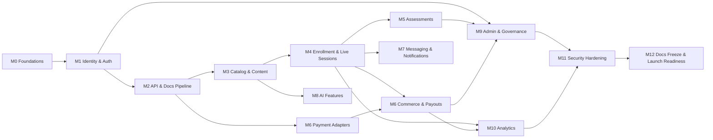

# Backend Build Milestones — Production-Grade, Secure, Fully Documented API

This is the engineering-execution breakdown for building the Django/DRF backend described in
[Technical Architecture](../01-architecture/01-technical-architecture.md),
[Database Schema](../02-database/01-database-erd-and-schema.md), and
[API Documentation](../03-api/01-api-documentation.md). It decomposes the 8-sprint
[Sprint Plan](01-jira-epics-stories-sprints-roadmap.md#3-sprint-plan-initial-8-sprints-2-weeks-each)
into 13 milestones with concrete scope, security gates, and a documentation bar for each —
answering "what does 'done' actually mean" at the level a backend engineer needs to build against.

Every milestone ships against the same [Definition of Done](#1-definition-of-done-applies-to-every-milestone).
A milestone is not complete because the endpoints respond; it's complete when the checklist passes.

## 1. Definition of Done (applies to every milestone)

- **Code**: reviewed and merged via PR — no direct pushes to `main`; migrations reviewed for
  lock/downtime risk on existing tables.
- **Tests**: unit + integration coverage ≥ 85% on new/changed lines; a negative authz test
  ("wrong role gets 403") exists for every new endpoint; contract tests generated from the
  OpenAPI spec pass against the running service.
- **Security**: the milestone's own security checklist (below) is verified; `pip-audit`/`npm
  audit`-equivalent dependency scan and secret scan are clean in CI.
- **API documentation**: `drf-spectacular` schema is regenerated from code, diffed against
  [`docs/03-api/02-openapi.yaml`](../03-api/02-openapi.yaml), and the committed spec is updated
  to match reality (the spec describes what the code does, never the reverse). Every new
  operation has a `summary`, correct `tags`, and at least one worked example. `npx @stoplight/spectral
  lint` passes with zero errors.
- **Swagger UI**: manually spot-checked — auth via the UI's "Authorize" button works, and
  "Try it out" succeeds against a locally running instance for at least the milestone's primary
  happy path.
- **Observability**: structured JSON logs and a request-count/latency metric exist for every new
  endpoint group; unhandled exceptions are traced, not just logged.
- **CI**: lint, type-check, test suite, OpenAPI lint, and security scan all green before merge.

## 2. Milestones

### M0 — Repository, Environments, and CI/CD Foundations
**Sprint 1** · Apps: `shared/`, `config/`

- Monorepo scaffold per [Platform Structure](../04-platform-structure/01-platform-structure.md):
  `backend/config/settings/{base,dev,stage,prod}.py`, `apps/`, `shared/`, `tests/`.
- Docker Compose for local dev: Postgres 16, Redis, RabbitMQ, Elasticsearch/OpenSearch.
- Custom user model stub, health-check endpoint, `django-environ` config, pre-commit
  (ruff, black, mypy, isort).
- GitHub Actions: lint → test → build on every PR (empty test suite passes trivially; the
  pipeline itself is the deliverable).
- Secrets: local `.env.example` committed, real secrets never committed, AWS Secrets Manager
  wiring stubbed for stage/prod settings.

**Security checklist**: `DEBUG=False` enforced outside `dev`; `SECRET_KEY` and DB credentials
sourced from environment, never hardcoded; `.env` in `.gitignore`.

**Exit criteria**: `docker compose up` boots a working Django admin locally in one command; a
trivial PR triggers and passes the full CI pipeline.

---

### M1 — Identity, AuthN/AuthZ, and Audit Foundation
**Sprint 1** · Apps: `identity`, `authorization`, `audit`
**Requirements**: FR-AUTH-001 – FR-AUTH-004, NFR-SEC-001, NFR-SEC-002

- Custom `User` model, `profiles`, `oauth_identities`, `refresh_tokens`, `mfa_factors` (per
  [schema §Identity and Access](../02-database/01-database-erd-and-schema.md)).
- JWT via `djangorestframework-simplejwt`: 15-minute access tokens, 30-day rotating refresh
  tokens, reuse-detection blacklist backed by Redis.
- OAuth2 social login (Google, Apple, Facebook) via `django-allauth` or equivalent adapters.
- MFA enrollment/verification (TOTP first; WebAuthn can follow in a later milestone).
- `roles`, `permissions`, `user_roles`, `role_permissions` models + a DRF permission class that
  resolves context-scoped roles (platform vs. organization) on every request.
- `audit_logs` app: an append-only log, write-only from application code (no update/delete
  path), populated via a signal/decorator so every privileged action is captured without each
  view remembering to log it manually.

**Security checklist**: password hashing via Argon2; rate limiting on `/auth/login` and
`/auth/mfa/verify` (Redis token bucket, per-IP and per-account); refresh-token reuse triggers
full session revocation; OWASP ASVS L1 auth checklist verified.

**API & Swagger**: `/api/v1/auth/*` fully live and documented (register, login, refresh, logout,
MFA enroll/verify, OAuth redirect/callback, me). This is the first milestone where Swagger UI's
"Authorize" flow must work end-to-end — treat it as the template every later milestone copies.

**Exit criteria**: a fresh user can register, verify MFA, log in via Google OAuth, and see their
own audit trail entries; a second user attempting an admin-only action gets a 403 that itself
gets audit-logged.

---

### M2 — API Foundation and Documentation Pipeline
**Sprint 1** · Apps: `shared/`, cross-cutting

- `/api/v1` versioning convention; cursor pagination as the default; a single DRF exception
  handler producing RFC 7807 `problem+json` for every error path (400/401/403/404/409/422/429/500).
- `drf-spectacular` wired as the schema generator; `/api/v1/schema/` and a Swagger UI at
  `/api/v1/docs/` live from day one, not bolted on later.
- CI gate: a job that regenerates the OpenAPI schema from code and fails the build if it differs
  from the committed `docs/03-api/02-openapi.yaml` — this is what keeps the spec truthful for
  the rest of the build instead of drifting silently.
- `Idempotency-Key` middleware for mutating endpoints flagged as idempotency-sensitive
  (checkout, webhooks), backed by a short-TTL Redis dedupe store.

**Security checklist**: CORS allowlist (no wildcard in stage/prod); standard security headers
(HSTS, `X-Content-Type-Options`, `Referrer-Policy`, CSP baseline) applied globally.

**Exit criteria**: a "hello world" authenticated endpoint is fully traceable from Django view →
generated OpenAPI operation → live Swagger UI → passing contract test, proving the whole
documentation pipeline before 100+ more endpoints get built on top of it.

---

### M3 — Course Catalog, Content, and Instructor Authoring
**Sprint 2–3** · Apps: `catalog`, `content`, `search`
**Requirements**: FR-CRS-001 – FR-CRS-004

- `courses`, `sections`, `lessons`, `videos`, `downloadable_resources`, `captions`,
  `transcripts`, `categories`, `tags` models and instructor-authoring CRUD.
- Course lifecycle state machine: draft → submitted → approved/rejected → published/archived,
  enforced server-side (not just in the client) so a status transition can never skip review.
- Video provider adapter (Mux/Bunny/Vimeo strategy pattern) with signed upload-init flow.
- Elasticsearch indexing via post-save signals + a Celery task (never index synchronously
  in the request path); `/search/courses` with the full filter set from
  [API docs §16](../03-api/01-api-documentation.md#16-search-and-filtering).

**Security checklist**: instructors can only mutate their own courses (object-level permission,
tested explicitly, not just role-level); uploaded resource files are type/size validated and
never served from the app's own domain unversioned (signed S3 URLs only).

**Exit criteria**: an instructor can author a course end-to-end and get it published through
review; a search query with combined filters returns correct, indexed results within the
NFR-PERF-001 target (P95 < 300ms).

---

### M4 — Enrollment, Learning Experience, and Live Sessions
**Sprint 4–5** · Apps: `learning`, `live_sessions`
**Requirements**: FR-LRN-001 – FR-LRN-003, FR-LIVE-001 – FR-LIVE-008

- `enrollments`, `progress_tracking`, `lesson_notes`, `bookmarks`, `wishlists`,
  `recently_viewed`, `certificates` (QR payload + PDF generation + verify endpoint).
- `conferencing_accounts` (encrypted OAuth tokens), `live_sessions`, `live_session_registrations`,
  `live_session_recordings`; the `ConferencingProvider` adapter for Zoom and Google Meet per
  the [core flows](../04-platform-structure/02-core-flows.md#9-live-session-scheduling-and-join-flow).
- Join-window enforcement as a server-side check on every `/live-sessions/{id}/join` call, not a
  client-side hide/show.
- Celery Beat tasks: reminder dispatch, and the Google Meet recording-availability poll (Zoom
  gets its recording via webhook in M6).

**Security checklist**: `conferencing_accounts.*_token_encrypted` never appears in any API
response or log line (add a test asserting this); join URLs are never returned to unregistered
or out-of-window requesters, verified with an explicit negative test.

**Exit criteria**: enroll → resume playback → earn certificate works end-to-end against seed
data; a live session's join link is provably unavailable one minute before the join window
opens and provably available one minute after.

---

### M5 — Assessments: Quizzes, Assignments, Coding Exercises
**Sprint 6** · Apps: `assessments`
**Requirements**: FR-LRN-004

- `quizzes`/`questions`/`answers` with attempt-limit and pass-score enforcement server-side.
- `assignments`/`assignment_submissions` with instructor grading endpoints.
- `coding_exercises`/`coding_exercise_test_cases`/`coding_exercise_submissions`: submissions run
  in an isolated, resource-limited sandbox (ephemeral container or third-party judge API — never
  `exec()` untrusted code in-process), dispatched via Celery so grading never blocks the request.

**Security checklist**: the coding-exercise sandbox has no network access and hard CPU/memory/
time limits; this is a genuine remote-code-execution surface and gets its own threat-model
review before launch, not just a code review.

**Exit criteria**: a quiz attempt is scored correctly against `pass_score`; a coding submission
is judged asynchronously and returns per-test-case pass/fail; a submission attempting to read
`/etc/passwd` or open a socket fails safely inside the sandbox.

---

### M6 — Commerce, Payments, and Payouts
**Sprint 4 (adapters) + Sprint 6 (full ledger)** · Apps: `commerce`, `billing`, `payouts`, `affiliates`
**Requirements**: FR-PAY-001 – FR-PAY-004

- `orders`/`order_items`/`payments`/`invoices`/`refunds`, `coupons`/`promotions`/`gift_cards`/
  `gift_card_redemptions`, `plans`/`subscriptions`, `wallets`/`transactions`, `payouts`,
  `affiliate_accounts`/`affiliate_referrals`/`affiliate_commissions`.
- Payment provider adapters (Stripe, PayPal, Flutterwave, Paystack, M-Pesa) behind a common
  interface; every webhook handler verifies its provider's signature before touching the
  database and is idempotent under redelivery (dedupe on provider event ID).
- Gift card and coupon/promotion application logic on `checkout/orders/{id}/apply-*`, with order
  totals always recomputed server-side from current prices — never trust a client-submitted total.

**Security checklist**: no raw card data ever reaches the application (gateway tokenization
only — verify with a code-level assertion, not just a policy statement); webhook endpoints
reject unsigned or replayed events with a test proving both; payout calculations are covered by
a reconciliation test that re-derives totals from the transaction ledger independently of the
payout job's own arithmetic.

**Exit criteria**: a checkout combining a coupon and a partial gift-card redemption reconciles
to the correct total under a duplicate webhook delivery; an instructor payout matches the sum
of their net transactions for the period, verified by an independent query.

---

### M7 — Messaging, Notifications, and Community
**Sprint 6** · Apps: `messaging`, `notifications`
**Requirements**: FR-COM-001 – FR-COM-003

- `threads`/`thread_participants`/`messages` over Django Channels; `notifications` +
  `notification_templates`/`email_templates` with multi-channel fan-out (in-app, email, SMS,
  push) dispatched via Celery, never inline in the request path.
- `reviews`/discussions tied to verified purchase (a review can only be created by a student
  with a completed enrollment on that course — enforced server-side).
- `support_tickets`/`support_ticket_messages` with SLA-aware status.

**Security checklist**: WebSocket connections authenticate via the same JWT as REST (no separate,
weaker auth path); a user can only join threads/channels they're a participant of, verified with
a negative test attempting to subscribe to another user's thread.

**Exit criteria**: a message sent in one browser tab is delivered over WebSocket to another
session in under 2 seconds (NFR-PERF-002); a notification template edited by an admin changes
the next dispatched notification without a deploy.

---

### M8 — AI-Assisted Learning
**Sprint 7 (or dedicated AI sprint per Q3 roadmap)** · Apps: `ai`, `recommendations`
**Requirements**: FR-AI-001 – FR-AI-004

- `ai_chat_sessions`/`ai_chat_messages` (course-scoped tutor), `ai_generation_jobs`/
  `ai_generated_content`/`flashcards` for summary/quiz/flashcard/transcript/subtitle generation,
  all dispatched as Celery jobs with a queued/running/completed/failed status the client can poll.
- Recommendation service reading from `analytics_events` + enrollment history.

**Security & policy checklist**: AI tutor sessions are scoped to the enrolled course's own
content (no answering questions about unrelated courses or platform internals); AI-assisted
grading output is stored as a *suggestion* with a required human-approval step before it affects
a real grade, per the SRS constraint on high-stakes AI output; per-user/day rate limits on
generation endpoints to bound cost exposure.

**Exit criteria**: a generation job produces and persists content within its queue SLA; an
AI-suggested grade cannot reach `assignment_submissions.grade` without an instructor's explicit
approval action, verified with a test.

---

### M9 — Admin, Governance, and Moderation
**Sprint 7** · Apps: `support`, `moderation`, `platform_settings`, `authorization`
**Requirements**: FR-ADM-001 – FR-ADM-004

- Instructor approval, course moderation queue (approve/reject with reasons), user
  suspend/reinstate, `settings` CRUD, coupon/promotion/email-template/notification-template
  admin CRUD (all of it via the endpoints added to
  [API docs §11](../03-api/01-api-documentation.md#11-admin-apis)).
- Every admin mutation writes to `audit_logs` — this milestone is where the M1 audit
  infrastructure gets exercised by real workflows, not just tested in isolation.

**Security checklist**: every admin endpoint has an explicit role check beyond "is staff" (finance
actions require Finance Officer, content approval requires Content Reviewer or Admin, etc.);
super-admin-only actions (e.g., irreversible deletes) require a second confirmation step server-side.

**Exit criteria**: an instructor application → course submission → approval → publish sequence
is exercised end-to-end by different role accounts, each step visible in the audit log with
correct actor attribution.

---

### M10 — Analytics and Reporting
**Sprint 7** · Apps: `analytics`
**Requirements**: platform-wide

- `analytics_events` ingestion pipeline (append-only, monthly-partitioned per
  [schema §Physical Design Notes](../02-database/01-database-erd-and-schema.md#4-physical-design-notes)),
  Celery Beat aggregation jobs feeding the revenue/engagement/completion/watch-time/drop-off/
  instructor-earnings report endpoints.
- Dashboards read from pre-aggregated tables, never from a live `GROUP BY` over raw events at
  request time.

**Security checklist**: report endpoints enforce the same role scoping as the underlying data
(an instructor's earnings report can only ever return that instructor's own numbers, even if
they pass another instructor's ID).

**Exit criteria**: aggregates computed by the pipeline match an independent SQL query against
seeded historical data; an analytics query against a full month of partitioned event data meets
its P95 target under load test.

---

### M11 — Security Hardening and Compliance Pass
**Sprint 8**

- Full OWASP ASVS review across everything built in M1–M10; dependency and secret scanning
  enforced as a CI merge-blocker (not advisory); rate limits tuned per-endpoint based on real
  usage patterns from staging.
- Field-level encryption verified for all PII and OAuth token columns (KMS-managed keys).
- GDPR/CCPA right-to-erasure workflow implemented and exercised against a real account,
  including legal-hold exceptions.
- Disaster-recovery drill: restore `RDS` from a snapshot and replay queued events, timed against
  the 2-hour RTO / 15-minute RPO targets in
  [DevOps & Infrastructure](../06-devops-security-qa/01-devops-infra-operations.md#6-disaster-recovery-plan).

**Exit criteria**: an external or internal penetration test finds no critical/high findings left
open; the DR drill completes within target; a data-erasure request removes all of a user's PII
while preserving financial records required for compliance retention.

---

### M12 — API Documentation Freeze, Performance, and Launch Readiness
**Sprint 8**

- Reconcile the generated OpenAPI spec 1:1 against every route in
  [API docs](../03-api/01-api-documentation.md) — all 125 routes present, every operation has a
  description and at least one example, `Spectral` lint is zero-error, and contract tests
  generated from the frozen spec pass in CI.
- Load testing to the targets in [SRS §4](../00-product/02-srs.md#4-non-functional-requirements):
  5K RPS search peak, 1K checkout/minute burst, soak-tested on queue-heavy workloads.
- Blue/green deployment rehearsal in staging with a scripted rollback, per the
  [Production Deployment Guide](../06-devops-security-qa/01-devops-infra-operations.md#7-production-deployment-guide).

**Exit criteria**: the committed OpenAPI spec is the actual source of truth for Swagger UI in
production (no manual edits diverging from code); load tests meet every P95 target; a rollback
rehearsal completes without data loss.

## 3. Milestone Dependencies

## 4. Sprint-to-Milestone Mapping

| Sprint | Milestones | Focus |
|---|---|---|
| 1 | M0, M1, M2 | Foundations, identity/auth, API + docs pipeline |
| 2–3 | M3 | Catalog, content, instructor authoring, search |
| 4 | M4 (start), M6 (payment adapters) | Enrollment, live sessions, payment provider wiring |
| 5 | M4 (complete) | Progress tracking, certificates, live-session hardening |
| 6 | M5, M6 (complete), M7 | Assessments, full commerce ledger, messaging/notifications |
| 7 | M8, M9, M10 | AI features, admin/governance, analytics |
| 8 | M11, M12 | Security hardening, documentation freeze, launch readiness |

## 5. Backend-Specific Risk Register

| Risk | Milestone | Mitigation |
|---|---|---|
| Coding-exercise sandbox is a genuine RCE surface | M5 | Isolated ephemeral runner, no network, hard resource limits, dedicated threat-model review before launch |
| Payment webhook replay causes double-fulfillment | M6 | Provider signature verification + idempotency dedupe on event ID, tested explicitly with replayed payloads |
| Conferencing OAuth tokens leak via logs/responses | M4 | Serializer-level field exclusion enforced by a test, not just convention |
| AI generation cost runs away under abuse | M8 | Per-user/day rate limits, async queue with backpressure, cost alerting |
| OpenAPI spec silently drifts from real behavior | M2, all | CI gate diffing generated schema against committed spec on every PR, not just at M12 |
| Analytics queries degrade checkout-path performance | M10 | Aggregation reads from pre-computed tables only; raw event table never queried synchronously in a request |
